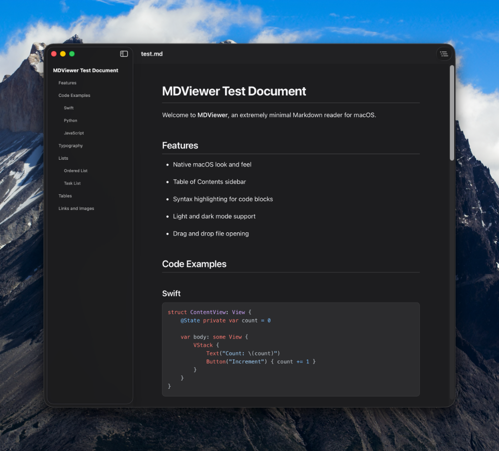

# MDViewer

A minimal Markdown reader for macOS. Native, fast, distraction-free.



## Features

- **Native macOS experience** — Built with SwiftUI + WKWebView, feels right at home
- **Table of Contents** — Auto-generated sidebar from headings, click to jump
- **Syntax highlighting** — Code blocks highlighted via [highlight.js](https://highlightjs.org/)
- **Light & Dark mode** — Follows system appearance automatically
- **Apple typography** — SF Pro fonts, comfortable reading width, clean spacing
- **Multiple ways to open** — Double-click `.md` files, drag & drop, or `⌘O`

## Install

### Homebrew (coming soon)

```bash
brew install --cask mdviewer
```

### Build from source

Requires **macOS 14+** and **Swift 5.9+**.

```bash
git clone https://github.com/punkwalter/mdviewer.git
cd mdviewer
swift build -c release
```

Create the app bundle:

```bash
./scripts/bundle.sh
```

This creates `MDViewer.app` — drag it to `/Applications`.

### Set as default Markdown viewer

Right-click any `.md` file → Get Info → Open with → Change All → select MDViewer.

Or via command line:

```bash
brew install duti
duti -s com.walt.mdviewer net.daringfireball.markdown viewer
duti -s com.walt.mdviewer .md all
```

## Usage

| Action             | How                        |
| ------------------ | -------------------------- |
| Open file          | `⌘O` or drag onto window   |
| Toggle TOC         | `⌘T`                       |
| Open from terminal | `open -a MDViewer file.md` |

## Tech Stack

- **SwiftUI** — App shell, sidebar, layout
- **WKWebView** — Markdown rendering with custom CSS
- **[swift-markdown](https://github.com/apple/swift-markdown)** — Apple's Markdown parser (AST → HTML)
- **[highlight.js](https://highlightjs.org/)** — Syntax highlighting (loaded from CDN)

## License

MIT
